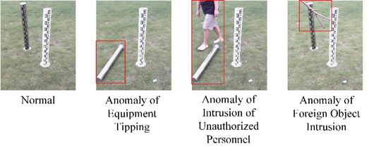
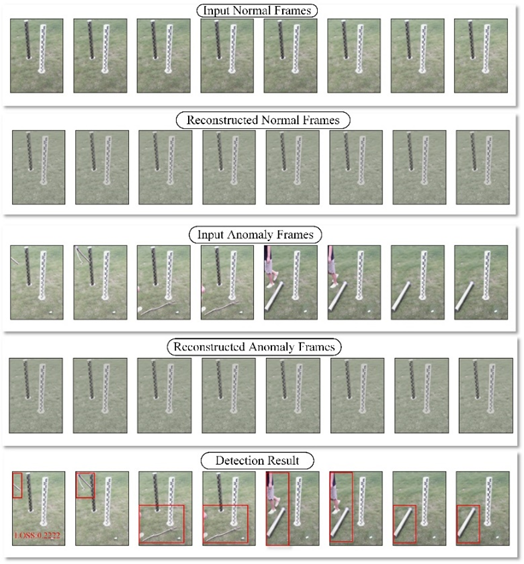

# Sentinel-Net: Anomaly Events Detection of Meteorological Stations Monitoring

This repository contains the source code and dataset used in the paper "*Sentinel-Net for Anomaly Events Detection of Meteorological Stations Monitoring*". Sentinel-Net is a convolutional autoencoder-based network designed for detecting anomalous events in surveillance videos collected from meteorological station environments.

## 📂 Project Structure
```
Sentinel-Net/
├── model/
│ └── trains_sentinel.py # Main script for training and inference
├── dataset/
│ ├── train/
│ │ ├── normal/ # Training images from normal images
│ │ └── anomaly/ # (Optional) Abnormal images, for testing only
│ └── val/
├── output/
├── post_process/ 
├── pro_process/ 
├── val/ 
├── requirements.txt
└── README.md
```
## ⚙️ Environment Setup
Install the required dependencies using:

```bash
pip install -r requirements.txt 
````
## 📦 Dataset Preparation
You can access this dataset from the provided.Supported formats: .png or .jpg.
```
https://pan.baidu.com/s/1lE1ffEIvluwZwNtztmeN9w?pwd=n74t.
```
```
dataset/
├── train/
│   └── normal/
|   └── anomaly/
└── val/
    ├── normal/
    └── anomaly/
```




## 🧠 Training and Inference
Run the main script:
```
python trains_sentinel.py
```
You will be prompted to choose:

.train – Train a new model using normal training samples.

.load – Load a pre-trained model and perform anomaly inference.

## 🔁 Training a New Model
The model is trained only on normal data.If you wish to replace it with your own dataset, first crop the normal sample images to 448 × 320 and then place them in the /dataset/train/normal folder.

You can choose one of the following activation functions: relu, leaky_relu, elu, prelu, or swish.

The trained model will be saved to:
output/model_attention.h5

Training loss will be logged to:
output/loss_data_sentinel.csv

A loss curve will also be automatically generated.

## 📊 Performing Inference
The script automatically loads the latest trained model or allows manual path input.

Performs inference on both normal and anomaly images in the validation set.

Outputs include:

Inference time per image

Reconstruction results

MSE and SSIM loss

Detection accuracy



### 🧾 Output Files
| File                            | Description                                 |
| ------------------------------- | ------------------------------------------- |
| `output/model_attention.h5`     | Trained model file                          |
| `output/loss_data_sentinel.csv` | Loss values recorded during training        |
| Terminal output                 | Inference logs including timing and metrics |


## 📌 Notes
Make sure font file paths (e.g., simhei.ttf) are correct if displaying Chinese characters in output.

All image files should be in .png or .jpg format.

Manually update the dataset path in test_sentinel.py if needed.

## 📐 Methodology
The Sentinel-Net architecture integrates:

Multi-scale convolutional kernels for feature diversity

Encoder-decoder structure for frame reconstruction

Combination of Mean Squared Error (MSE) and Structural Similarity Index (SSIM) for reconstruction loss

Frame-level anomaly classification based on reconstruction error

Evaluation is performed using frame-level accuracy, loss comparison, and optional ablation studies on activation functions and network configurations.

## 📚 Citation
If you use this code or dataset, please cite our work:

Bingyan Wang, et al. "Sentinel-Net for Anomaly Events Detection of Meteorological Stations Monitoring", PeerJ Computer Science, 2025.

## 📬 Contact
For questions, please contact:
```
📧 20231513125@sspu.edu.cn
```

## 📄 License
This project is released under the MIT License. See the LICENSE file for details.

## 🙌 Contribution Guidelines
We welcome contributions! Please open an issue or submit a pull request for bug fixes or improvements.